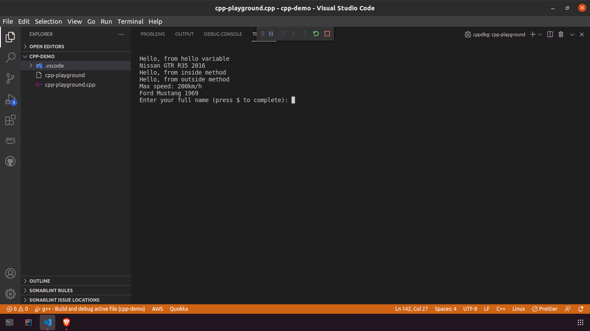

## C++ Playground
A basic C++ program making use of user input, macro definitions and basic object-oriented programming principles.

## Installation
1. Insure C++ is installed on your machine.
2. Clone the repo:
```
git clone https://github.com/codecventer/cpp-playground.git
```
3. Using VS Code, build the program by pressing **F5** before selecting **C++(GDB/LLDB)** and then **g++ - Build and debug active file** respectively when prompted.

## How to use?
After a successful build, simply press **F5** again to run the program. You should then see the following inside the terminal window:


## Authors
- [Christiaan Venter](https://www.github.com/codecventer)
